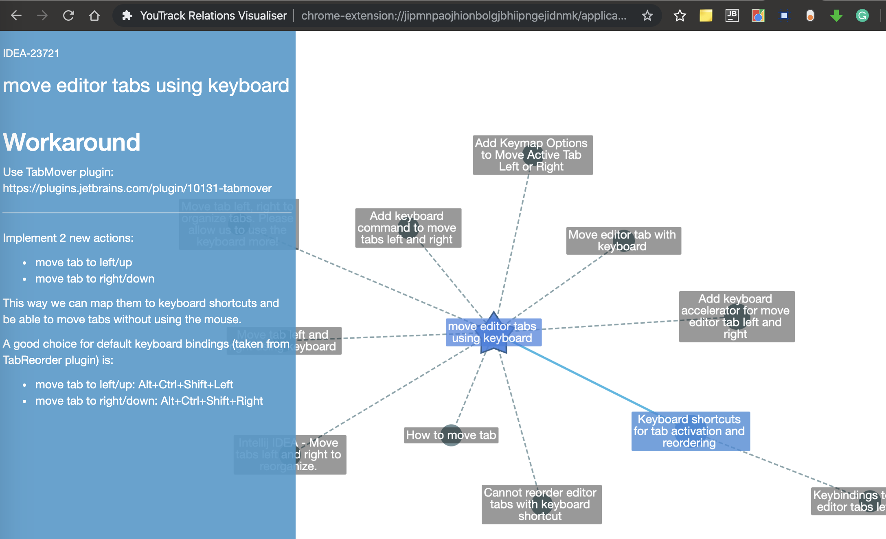

# YouTrack relations visualiser for Chrome

1. Install the extension: you can follow https://superuser.com/questions/247651/how-does-one-install-an-extension-for-chrome-browser-from-the-local-file-system
2. Go to extension options -> Specify Hub authentication token: https://www.jetbrains.com/help/hub/manage-authentication-tokens.html
3. Open some issue and click on the extension icon. Enjoy

Controls:
- Ctrl-1, Ctrl-2... - open N-depth graph
- LMB on issue node: select issue & open preview
- RMB: context menu
- Ctrl-R - toggle "Hide Resolved" mode
- Ctrl-L - toggle "Hide Labels" mode
- ~~start typing: search~~ (work in progress)

Navigation:
- left, right arrows: switch via related issues of the selected node
- Space: focus the selected node
- scroll to zoom

